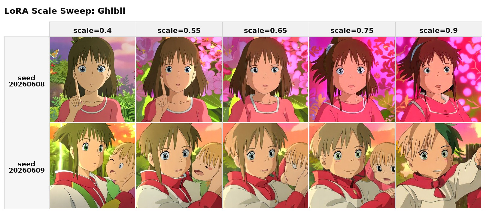
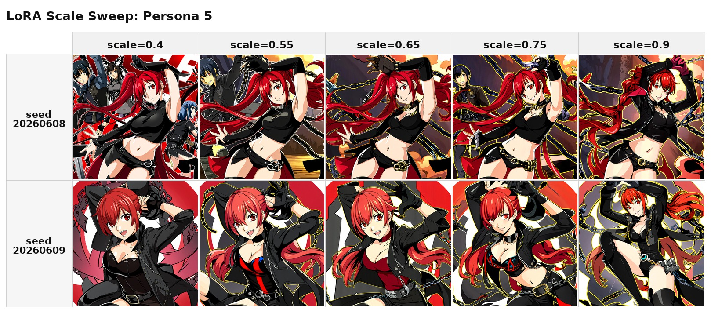
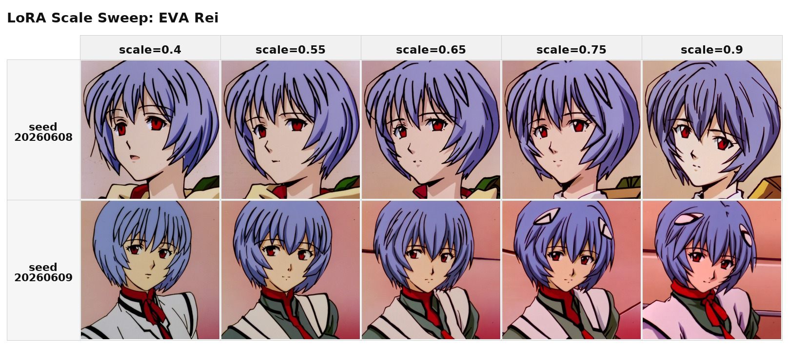
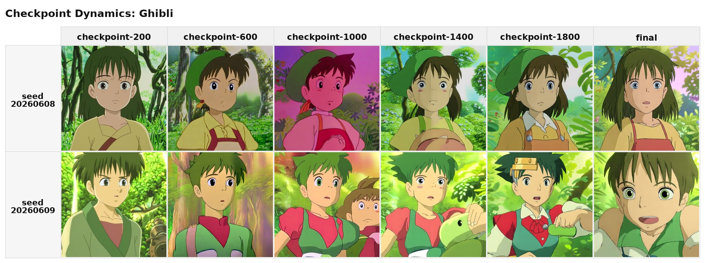
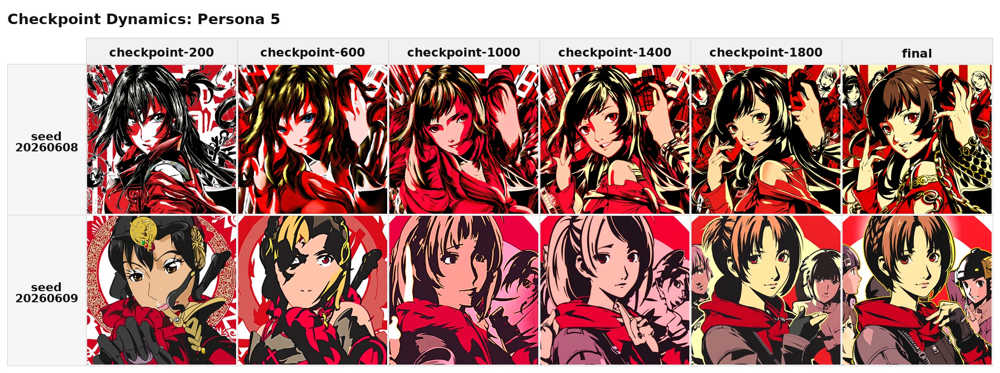
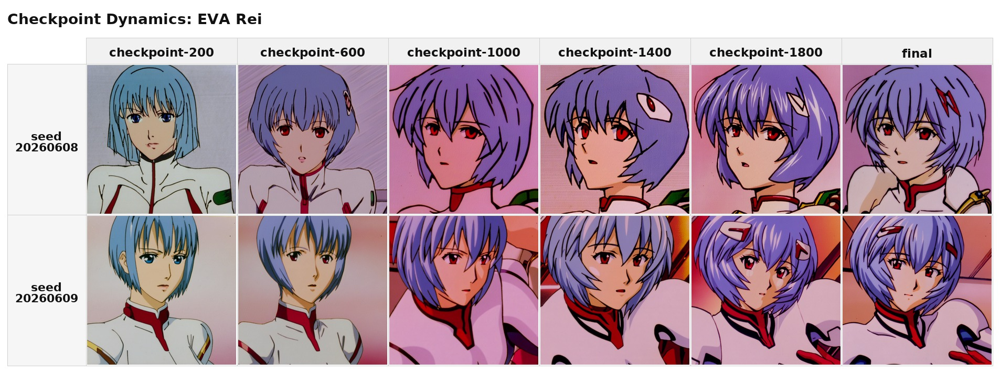
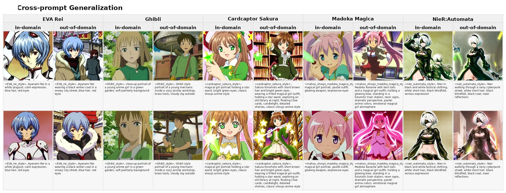
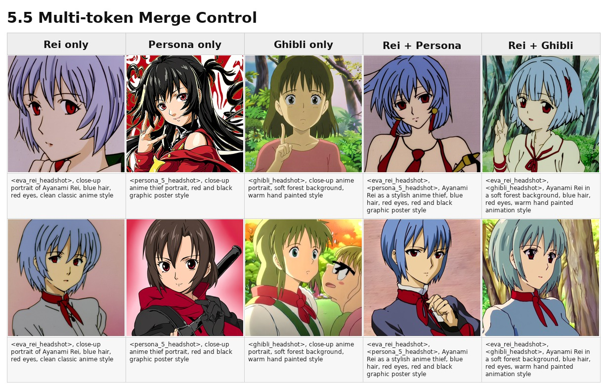
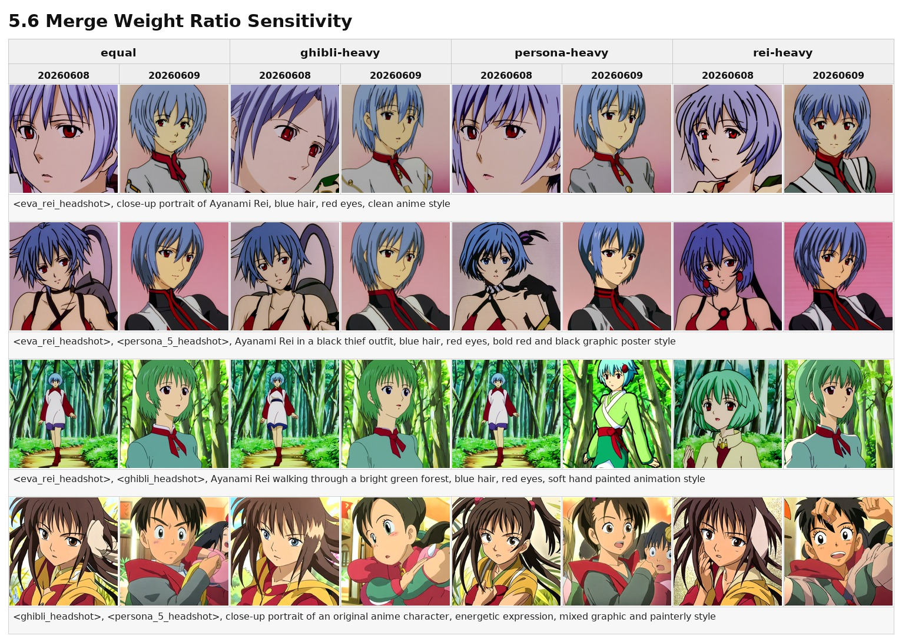

# SDXL 小样本动漫人物与风格 LoRA 微调实验报告

## 1. 项目目标

本项目研究在小样本动漫头像数据集上，如何使用 SDXL、PTI warmup 和 LoRA 微调得到可控的人物与风格生成能力。我们的目标不是只训练一个统一风格，而是把训练目标拆成两类关键词：

- 人物关键词：`<eva_rei_headshot>`，用于学习 Ayanami Rei 的身份特征。
- 风格关键词：`<persona_5_headshot>` 与 `<ghibli_headshot>`，分别用于学习 Persona 5 式红黑图形化风格和吉卜力式柔和手绘动画风格。

报告重点分析六个问题：原始 SDXL 与单 LoRA 的差异、推理阶段 LoRA scale 的影响、训练 checkpoint 的动态、跨 prompt 泛化能力、多 token merge 后的组合控制能力，以及 merge 权重是否提供可解释的控制。

本轮报告实验只包含推理和 LoRA merge，不包含新的训练。

## 2. 数据集与标注

当前实验使用三个小数据集：

| 数据集 | 图像数量 | 训练 token | 目标 |
|---|---:|---|---|
| `data/Ghibli` | 24 | `<ghibli_headshot>` | 吉卜力感人物与场景头像 |
| `data/persona_5` | 24 | `<persona_5_headshot>` | Persona 5 红黑图形化人物风格 |
| `data/EVA_rei` | 23 | `<eva_rei_headshot>` | Ayanami Rei 人物身份 |

每张图片配有同名 `.txt` caption。caption 采用短描述，而不是堆叠通用高质量标签。原因是小数据集 LoRA 对错误 caption 较敏感，过长或虚构的 caption 容易把不存在的服装、动作、背景写入训练信号。清理 caption 时，我们主要保留主体、发色、表情、服装、背景和风格相关信息，并避免让 caption 自己“脑补”图片中没有出现的细节。

## 3. 技术路线

### 3.1 使用 SDXL 的理由

SDXL 相比 SD 1.5 有更强的基础图像质量和 prompt 理解能力，适合 1024 x 1024 分辨率的人物头像生成。课程作业需要比较基础模型和微调模型时，SDXL base 也能提供更强的对照组：如果 LoRA 在 SDXL base 已经较强的情况下仍然带来稳定风格变化，说明微调确实学习到了数据集中的特征，而不是只弥补基础模型能力不足。

### 3.2 使用 PTI warmup 的理由

我们不是只想训练通用风格词，而是希望模型学会新的触发词，例如 `<eva_rei_headshot>`。本项目中的 PTI warmup 采用 Textual Inversion 式 token embedding 预热：先只优化新 token 在 SDXL 两个 text encoder 中的 embedding，让 token 初步对齐目标人物或风格概念。之后再训练 LoRA，可以减少“新 token 没有语义、LoRA 需要同时学习触发和风格”的不稳定性。

这种路线适合小样本人物和风格数据集，因为训练初期模型至少知道新 token 应该指向哪类视觉概念，后续 LoRA 主要负责把概念映射到 UNet 的图像生成行为上。

### 3.3 使用 LoRA 的理由

LoRA 不直接全量更新 SDXL，而是在 UNet 和 text encoder 的部分线性层上学习低秩增量。可以把一个被 LoRA 修改的权重写成：

```text
W' = W + scale * B @ A
```

其中 `A` 和 `B` 是低秩矩阵。LoRA 的优点是训练成本低、checkpoint 小、适合小数据集，并且便于单独训练多个风格或人物后再做合并。对课程作业来说，LoRA 还让我们能方便地比较 checkpoint、扫描推理 scale，并把多个概念组合到同一个 adapter 中。

### 3.4 Multi-token Merge 的设计

普通 merge 可以把多个 LoRA 合成一个 adapter，但如果把 learned embedding 也平均成一个 token，会损失控制性。我们的目标是测试“人物 token + 风格 token”的组合，因此 merge 时保留三个 learned token：

```text
<eva_rei_headshot>
<persona_5_headshot>
<ghibli_headshot>
```

具体做法是使用 concat merge 合并 LoRA 权重，同时使用 `--embed-merge keep` 保存各自的 token embedding。这样同一个 merged adapter 可以生成：

```text
<eva_rei_headshot> + <persona_5_headshot>
<eva_rei_headshot> + <ghibli_headshot>
```

需要注意的是，merge 后的 UNet LoRA 权重是一个合并后的低秩增量，三个 token 共享这组图像生成增量。因此 multi-token merge 能提供组合控制，但不是严格解耦的模块化控制。

## 4. 实验参数

已完成 LoRA 训练阶段使用的主要参数：

| 参数 | 值 |
|---|---|
| Base model | SDXL base 1.0 |
| Resolution | 1024 x 1024 |
| Batch size | 1 per GPU |
| Gradient accumulation | 4 |
| Max steps | 2000 |
| PTI warmup steps | 500 |
| Checkpoint interval | 200 |
| LoRA rank / alpha | 16 / 16 |
| UNet LoRA learning rate | `1e-4` |
| Text encoder LoRA learning rate | `5e-6` |
| PTI learning rate | `5e-4` |
| Precision | fp16 |

本轮报告推理实验参数：

| 参数 | 值 |
|---|---|
| Scheduler | DPMSolverMultistepScheduler |
| Resolution | 1024 x 1024 |
| Steps | 30 |
| Guidance scale | 7.5 |
| Default LoRA scale | 0.65 |
| Seeds | `20260608`, `20260609` |
| 新训练 | 无 |

复现实验入口：

```bash
SEED_BASE=20260608 WIDTH=1024 HEIGHT=1024 STEPS=30 bash experiments/run_report_experiments.sh
```

原始推理产物位于：

```text
outputs/report_experiments/seed_20260608/contact_sheets/
```

为方便直接阅读 Markdown，报告中使用的结果图已生成到 `reports/figures/` 并在对应实验小节中嵌入。图中的标签只保留关键变量；完整 prompt 定义见 `experiments/report_prompts.json`。

## 5. 实验结果

### 5.1 原始 SDXL vs 单 LoRA

目的：比较 base SDXL 和单风格 LoRA 在相同 prompt 和 seed 下的差异。

结果图将三种风格放在同一张图中。每个风格占两列：`Base SDXL` 和 `LoRA`；每一行图片下方标注对应的 LoRA prompt。


| 对比 | 观察 | 结论 |
|---|---|---|
| SDXL base vs Ghibli LoRA | Base SDXL 能生成柔和森林或天空背景，但整体更像通用现代动漫头像，细节和光影偏数字绘制。Ghibli LoRA 后，脸型更圆、线条更简化，背景和颜色更接近老式手绘动画。 | Ghibli LoRA 主要改变画风和背景质感，而不是只改变主体。效果明显，但会带来更固定的头像构图。 |
| SDXL base vs Persona 5 LoRA | Base SDXL 对“红黑 graphic poster”和“anime thief”已经有一定理解。Persona 5 LoRA 后，红黑色块、黑色服装、夸张姿势和海报构图更稳定，画面更饱和。 | 该 LoRA 的价值主要是提高风格一致性。由于 base 本身已经能响应 prompt，提升不是从无到有，而是从“像”变成“更稳定地像”。 |
| SDXL base vs EVA Rei LoRA | Base SDXL 已经知道 Ayanami Rei 的蓝发、红眼和白色 plugsuit，但有时会变成更现代、更通用的 anime character。EVA Rei LoRA 后，蓝色短发、红眼、冷淡表情和经典赛璐璐线条更集中。 | EVA Rei LoRA 明显强化身份特征，同时也把画面拉向更经典的旧动画截图质感。 |

### 5.2 LoRA Scale 扫描

目的：分析 `lora_scale` 对风格强度、人物稳定性和画面质量的影响。

测试 scale：

```text
0.4 / 0.55 / 0.65 / 0.75 / 0.9
```

结果图按风格拆分。图中列表示 `lora_scale`，行表示 seed。







| 风格 | 推荐 scale | 观察 |
|---|---:|---|
| Ghibli | 0.55-0.65 | `0.4` 已有手绘动画感，但风格较弱。`0.55` 和 `0.65` 的人物、森林背景和色彩比较平衡。`0.75` 以后粉色花丛、饱和绿色和大眼特征更强，`0.9` 有训练图构图被放大的倾向。 |
| Persona 5 | 0.65-0.75 | `0.4` 已经能看到红黑和 thief 元素。`0.65` 到 `0.75` 的红黑海报、黑色服装和线条最稳定。`0.9` 风格更强，但背景和装饰更拥挤，画面容易被链条、红色块和姿势主导。 |
| EVA Rei | 0.55-0.65 | `0.4` 已能保留 Rei 身份。`0.55` 和 `0.65` 在红眼、蓝发、脸型和清晰度之间较平衡。`0.75` 到 `0.9` 身份更强，但背景趋于粉色平面，裁切和姿势更接近训练集模板。 |

总体看，`0.65` 是合理默认值。它不是每个样例的最强风格，但在三类 LoRA 上都能避免过弱或过拟合感过强。

### 5.3 Checkpoint 训练动态

目的：观察训练过程中风格或人物特征何时出现，是否在后期过拟合。

测试：

```text
checkpoint-200 / checkpoint-600 / checkpoint-1000 / checkpoint-1400 / checkpoint-1800 / final
```

结果图按风格拆分。图中列按训练顺序排列 checkpoint，行表示 seed。







| 风格 | 早期 checkpoint | 中后期 checkpoint | final |
|---|---|---|---|
| Ghibli | `checkpoint-200` 已经出现森林、圆眼和手绘动画感，但人物仍偏 generic。 | `checkpoint-600` 到 `checkpoint-1400` 风格明显稳定，背景和角色更统一。`checkpoint-1800` 后风格更强，但部分样例更像固定截图模板。 | final 不是绝对优于中期 checkpoint。它风格最集中，但也更容易出现大眼、近景和训练集构图偏好。 |
| Persona 5 | `checkpoint-200` 已能产生红黑、强对比和漫画海报，但人物稳定性不够，部分脸和构图较怪。 | `checkpoint-600` 到 `checkpoint-1400` 风格迅速变稳定，红黑块、黑衣和装饰元素很强。 | final 保持强风格，但相对 `checkpoint-1000` 后提升有限。该 LoRA 较早进入平台期。 |
| EVA Rei | `checkpoint-200` 已能生成蓝发红眼，但经典 Rei 脸型和旧动画线条还不够稳定。 | `checkpoint-600` 后身份明显增强，`checkpoint-1000` 到 `checkpoint-1800` 的 Rei 特征和赛璐璐风格都较稳定。 | final 与 `checkpoint-1800` 接近，身份很强，但变化空间更小。 |

这个实验说明，小样本 LoRA 不一定需要只看 final checkpoint。对 Ghibli 和 Persona 5 来说，中后期 checkpoint 已经足够强；final 更适合作为默认交付模型，但中间 checkpoint 可以作为减少过拟合感的备选。

### 5.4 跨 Prompt 泛化

目的：比较 in-domain 和 out-of-domain prompt，判断 LoRA 是否只记住训练集构图。

结果图将三种风格放在同一张图中。每个风格占两列：`in-domain` 和 `out-of-domain`；每一行图片下方标注对应 prompt。



| 风格 | In-domain 表现 | Out-of-domain 表现 | 泛化结论 |
|---|---|---|---|
| Ghibli | 花园、森林、年轻角色这些接近训练分布的 prompt 表现稳定，颜色、眼睛和背景都很统一。 | airship workshop prompt 下仍保留柔和手绘动画感，并能生成机械舱、黄铜工具和窗外天空等新场景元素。 | Ghibli LoRA 学到的是可迁移画风，在远离森林/花园场景时仍能保持风格，但人物形象会向训练集中的圆脸、少年感靠拢。 |
| Persona 5 | thief、黑衣、红黑背景表现非常稳定，构图很接近 Persona 5 海报风格。 | detective prompt 下能保留黑衣、红手套、霓虹城市和红黑图形背景。 | Persona 5 LoRA 对同域 prompt 很强，换成 detective 这种相邻角色设定后仍能迁移，说明它不只是记住 thief 单一词。 |
| EVA Rei | plugsuit、蓝发、红眼和冷淡表情都稳定出现。 | 冬季街景和黑色外套下仍能保留蓝发、红眼和 Rei 的冷静表情，只是服装按 prompt 改变。 | EVA Rei 是三个 LoRA 中泛化最稳定的一个，说明人物身份 token 比复杂风格 token 更容易跨场景保持。 |

### 5.5 Multi-token Merge 控制

目的：在一个 merged adapter 内测试人物 token 和风格 token 的组合控制。

重点 prompt：

```text
<eva_rei_headshot>, <persona_5_headshot>, Ayanami Rei ...
<eva_rei_headshot>, <ghibli_headshot>, Ayanami Rei ...
```

结果图中每列表示一个 token 组合，每个 seed 的图片下方标注对应 prompt。



| 组合 | Rei 身份保留 | 风格迁移 | 问题 |
|---|---|---|---|
| Rei only | 蓝发、红眼、短发和冷淡表情稳定，接近单 EVA Rei LoRA。 | 主要是经典旧动画风格，没有明显 Persona 5 或 Ghibli 背景。 | 构图偏近景，变化范围较小。 |
| Persona only | 不涉及 Rei 身份。 | 红黑海报、黑衣、武器或 thief 元素明显。 | 部分 seed 中人物更像通用 Persona 风格角色，而不是完全由 prompt 决定。 |
| Ghibli only | 不涉及 Rei 身份。 | 森林背景、柔和手绘色彩和圆眼角色稳定。 | 角色发色和形象容易被 Ghibli 数据集风格带走。 |
| Rei on Persona 5 | 蓝发、红眼和 Rei 式表情基本保留。 | 出现黑红服装、红色背景、围巾和更锐利的赛璐璐图形感。 | Persona 5 风格弱于 Persona only，说明 Rei token 会抢占一部分画面控制。 |
| Rei on Ghibli | 蓝发、红眼基本保留，人物气质仍接近 Rei。 | 森林背景、柔和线条和手绘动画感明显。 | 头发颜色有时变浅或偏绿，Ghibli 风格会削弱 Rei 的精确身份。 |

结论是，multi-token merge 可以实现“Rei on Persona 5”和“Rei on Ghibli”这种组合，但不是严格独立控制。人物 token 更容易保留脸和发色，风格 token 更容易影响背景、色彩和线条，两者同时出现时会互相竞争。

### 5.6 Merge 权重比例

目的：测试 concat merge 中不同权重是否影响最终风格倾向。

测试权重：

```text
equal = 1 / 1 / 1
ghibli-heavy = 0.6 / 0.2 / 0.2
persona-heavy = 0.2 / 0.6 / 0.2
rei-heavy = 0.2 / 0.2 / 0.6
```

结果图采用 8 列布局：4 个 merge 权重设置，每个权重设置包含两个 seed；每一行图片下方标注对应 prompt。



| 权重设置 | Rei only | Rei on Persona 5 | Rei on Ghibli | 结论 |
|---|---|---|---|---|
| equal | Rei 身份稳定，接近单人物 LoRA。 | 有黑衣、红色背景和 Persona 5 式姿势，但不如 Persona only 强。 | 有森林和手绘感，部分 seed 的发色会偏绿。 | equal 是可用默认值，适合保持三类 token 都可调用。 |
| ghibli-heavy | Rei only 仍可用，但旧动画感和柔和色彩更明显。 | Persona 5 的红黑冲击力被削弱，人物更接近普通旧动画角色。 | 森林、绿色背景和 Ghibli 风格更强，但 Rei 身份有时被弱化。 | 增大 Ghibli 权重能增强 Ghibli 倾向，但会牺牲 Persona 5 组合的强度。 |
| persona-heavy | Rei only 仍保留身份，部分样例更锐利。 | 黑衣、红黑背景和更强的动作姿态更明显。 | Ghibli prompt 仍能产生森林和手绘感，但颜色更硬，人物不如 ghibli-heavy 柔和。 | Persona-heavy 对 Rei on Persona 5 有帮助，但对其他 prompt 会带来更强的图形化干扰。 |
| rei-heavy | Rei only 最稳定，蓝发红眼和脸型更集中。 | Rei 身份保持较好，但 Persona 5 风格不如 persona-heavy 强。 | Rei 身份更明显，但 Ghibli 氛围被压弱，部分样例更像 Rei 站在森林中。 | Rei-heavy 适合优先保证人物身份，但会降低风格 token 的主导性。 |

权重实验说明，merge 权重是一个粗粒度倾向控制，而不是线性的风格滑杆。由于 prompt token 仍然会强烈影响生成结果，权重变化需要和 prompt 一起看。对报告图而言，equal merge 最适合作为 multi-token 控制展示，persona-heavy 和 ghibli-heavy 更适合作为补充对比。

## 6. 总体结论

1. 单 LoRA 相比原始 SDXL 有明显效果。Ghibli LoRA 主要改变手绘动画质感，Persona 5 LoRA 提高红黑图形风格的一致性，EVA Rei LoRA 强化具体人物身份。
2. `lora_scale=0.65` 是合理默认值。较低 scale 更保留 base SDXL 的多样性，较高 scale 风格更强但更容易出现构图模板化、背景拥挤或颜色过饱和。
3. final checkpoint 不总是视觉上最优。三个 LoRA 都在中期 checkpoint 已经形成主要特征，final 更稳定但也更接近训练集偏好。
4. 泛化能力因任务不同而不同。Rei 身份 token 最稳定，Ghibli 风格能迁移到 airship workshop 这类新场景，Persona 5 对红黑 thief 语境最强，但在 detective 设定下也能保留图形化风格。
5. Multi-token merge 可以在一个 adapter 中保留多个触发词，并能生成 Rei on Persona 5 和 Rei on Ghibli。但人物和风格并不完全解耦，组合时存在发色、背景、服装和线条风格之间的竞争。
6. Merge 权重能改变整体倾向，但控制粒度有限。实际使用时，prompt token、LoRA scale 和 merge 权重需要一起调。

综合来看，适合本项目的默认推理配置是：使用 final 或 `checkpoint-1400` 之后的 LoRA，默认 `lora_scale=0.65`，需要更强风格时上调到 `0.75`，需要保留基础模型多样性时下调到 `0.55`。多 token merge 推荐优先使用 equal 权重版本，在具体 prompt 中通过显式写入人物 token 和风格 token 来控制生成方向。

## 7. 局限性

当前实验仍有几个限制：

- 每个数据集只有 20 多张图，容易学习到训练图构图偏好。
- 人工 caption 虽然清理过，但仍可能存在描述粒度不一致。
- Multi-token merge 的 token 控制不是严格解耦，人物和风格可能互相污染。
- 本报告主要依赖人工视觉观察，没有使用 FID/KID 等大样本指标。
- 每个 prompt 只使用两个 seed，能够观察主要趋势，但不足以覆盖全部随机性。

## 8. 后续改进

后续可以继续做三类改进：

1. 扩充每个数据集到 50-100 张，并让 caption 粒度更一致。
2. 对 checkpoint 和 scale 做更细的二维网格，寻找不同 LoRA 的最佳推理区间。
3. 增加 CLIP image similarity、LPIPS 或人工打分表，减少只依赖主观观察的问题。
