# SDXL 小样本动漫风格与角色 LoRA 微调实验报告

姓名：朱昱醒

学号：523031910823

## 摘要

本实验围绕 SDXL base 1.0 的小样本 LoRA 微调展开，目标是在少量动漫风格或角色图像上训练可控触发词，使模型能够通过单个 token 调用特定角色或视觉风格。实验使用 `data/` 下 5 个独立数据集：`EVA_rei`、`Ghibli`、`cardcaptor_sakura`、`mahou_shoujo_madoka_magica` 和 `nier_automata`。报告中的推理对比保持统一分辨率、采样步数和 guidance scale，以便观察不同 LoRA、scale、checkpoint 和 merge 设置对生成结果的影响。

结果显示，小样本 LoRA 可以明显强化角色身份、服装结构、色彩倾向和线条风格。角色型数据集在近似人物设定和肖像场景中更稳定，例如发色、眼睛、服装轮廓和标志性配饰会更容易被触发；风格型或混合型数据集更多表现为色彩、构图、背景氛围和画面质感偏置。LoRA scale、checkpoint 阶段和多 LoRA merge 权重都会影响可控性：scale 决定训练集特征介入强度，checkpoint 体现训练过程中身份和风格的形成过程，merge 则测试多个 token 是否能在同一 adapter 中保持可组合性。

## 数据集与方法

| 数据集 | 图片数 | caption 数 | 触发词 | 训练目标 |
|---|---:|---:|---|---|
| `EVA_rei` | 20 | 20 | `<EVA_rei_style>` | Ayanami Rei 角色特征 |
| `Ghibli` | 24 | 24 | `<Ghibli_style>` | 柔和手绘动画风格 |
| `cardcaptor_sakura` | 24 | 24 | `<sakura_style>` | 魔法少女与 shoujo 风格 |
| `madoka_magica` | 21 | 21 | `<madoka_style>` | 魔法少女题材角色与画风 |
| `nier_automata` | 21 | 21 | `<nier_style>` | NieR:Automata 角色与服装特征 |

表中数据集名为报告中的短名称，完整目录分别位于 `data/EVA_rei`、`data/Ghibli`、`data/cardcaptor_sakura`、`data/mahou_shoujo_madoka_magica` 和 `data/nier_automata`。为避免表格过宽，较长触发词在表中使用短写；训练脚本中的完整触发词仍以对应数据集配置为准。

训练参数保持仓库 baseline：分辨率 `1024 x 1024`、batch size `1`、gradient accumulation `4`、总训练步数 `2000`、TI/PTI warmup `500`、LoRA rank `16`、mixed precision `fp16`。这些设置没有针对单个数据集额外调参，因此不同风格之间的差异主要来自数据内容、caption 分布和 LoRA 本身的学习效果。推理实验使用 `1024 x 1024`、30 steps、guidance scale 7.5，并在同一实验内保持 prompt 结构一致，以减少非实验变量对观察结论的干扰。

## 1. Base SDXL vs 单 LoRA

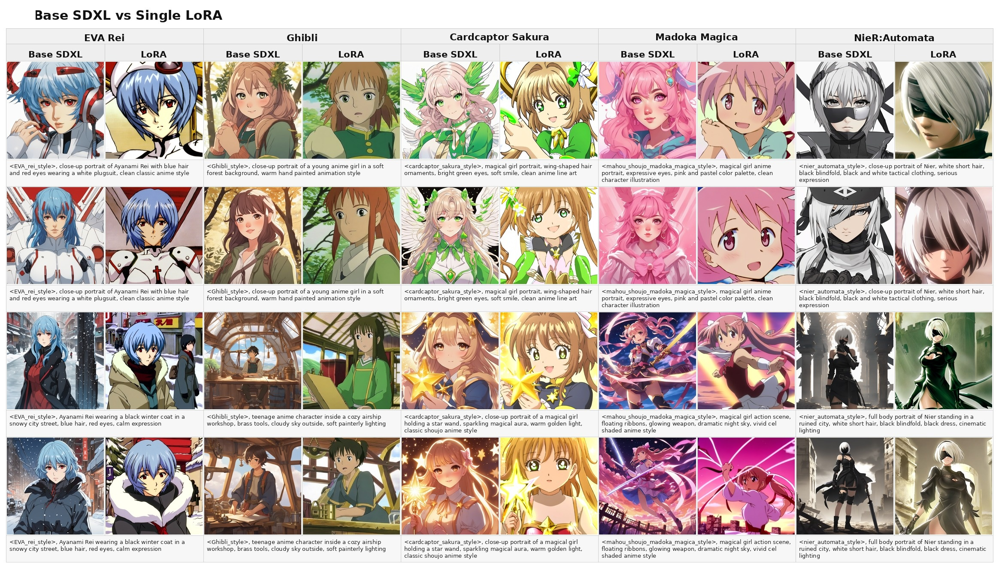

Base SDXL 已经能理解通用动漫 prompt，能够生成大致合理的人物、服装和场景，但它对本实验数据集中具体身份、画风和服装结构的稳定性有限。加入单 LoRA 后，角色型数据集的变化最直接：`EVA_rei` 的蓝发红眼、冷静表情和白色战斗服轮廓更加集中；`cardcaptor_sakura` 的魔法少女服饰、星杖、明亮装饰和 shoujo 线条更明显；`nier_automata` 的白色短发、黑色眼罩、黑白服装和较冷的机械题材氛围也更接近训练目标。`Ghibli` 和 `mahou_shoujo_madoka_magica` 更偏风格或题材偏置，主要改变色彩、线稿、背景氛围和角色轮廓，而不是只固定单个身份。

该对比说明 LoRA 并不是简单地增加画面细节，而是把训练集中高频出现的视觉结构注入到 base SDXL 的生成过程中。对于角色数据集，LoRA 强化的是可识别身份和服装语义；对于风格数据集，LoRA 强化的是色彩、笔触、构图和背景组织方式。实验中也可以看到，较强的 LoRA scale 会使目标特征更显著，但同时会降低 prompt 的自由度，因此后续 scale 扫描需要进一步分析强度和泛化之间的平衡。

## 2. LoRA 强度对生成效果的影响

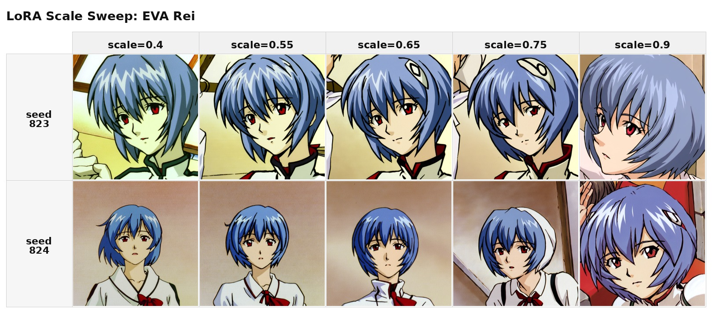

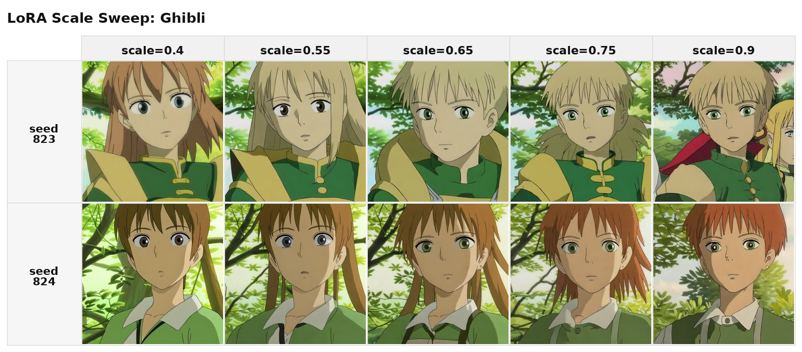

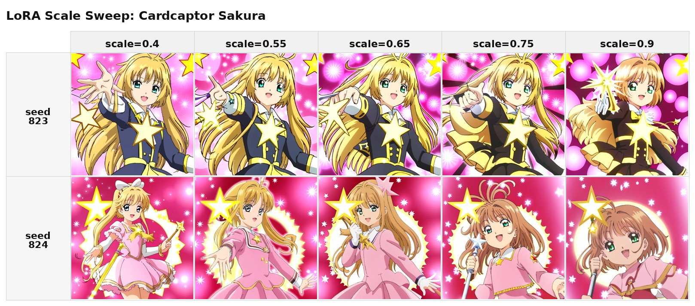

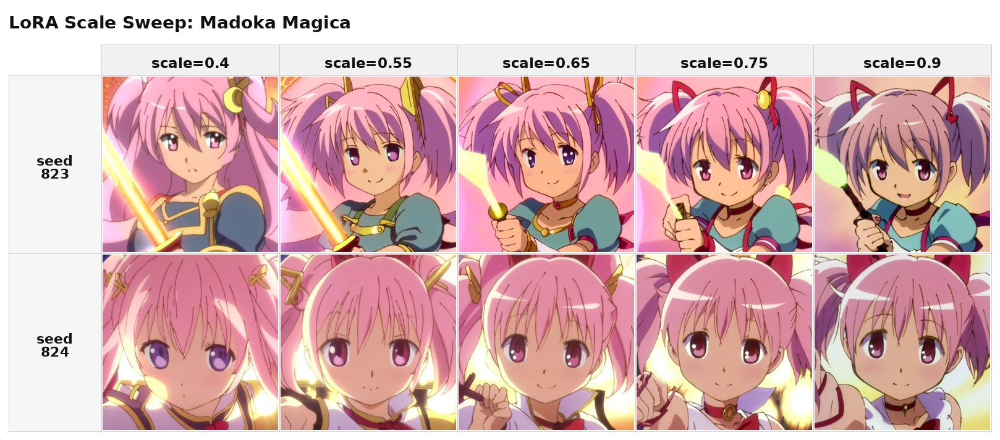

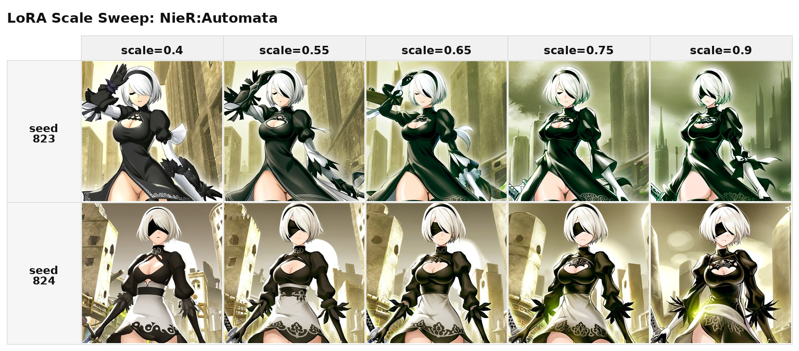

LoRA scale 决定 adapter 对 base SDXL 的干预强度。较低的 `0.4` 和 `0.55` 更接近 base SDXL，画面通常具有更强的场景自由度，prompt 中的新物体、新背景和动作更容易被保留，但身份或风格强度偏弱，角色的关键特征可能只表现为局部颜色或轮廓提示。`0.65` 在多数数据集上较均衡，既能保留 prompt 内容，又能提供可见的训练集特征，是比较适合报告主实验的默认强度。

继续提高到 `0.75` 和 `0.9` 后，风格和身份会更集中，角色服装、发色、配饰和背景质感更接近训练集；但副作用也更明显，例如构图趋于模板化、背景更拥挤、颜色更饱和，局部细节可能变得僵硬。角色型 LoRA 通常在高 scale 下更容易锁定身份，但也更容易把不同 prompt 拉回训练集常见姿态；风格型 LoRA 则会在高 scale 下强烈改变整体调色和笔触。综合观察，`0.65` 适合作为通用默认值，而对身份较弱或特征较复杂的数据集，可以在单独展示时提高 scale。

## 3. 训练步数与 Checkpoint 演化

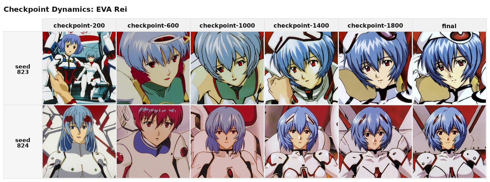

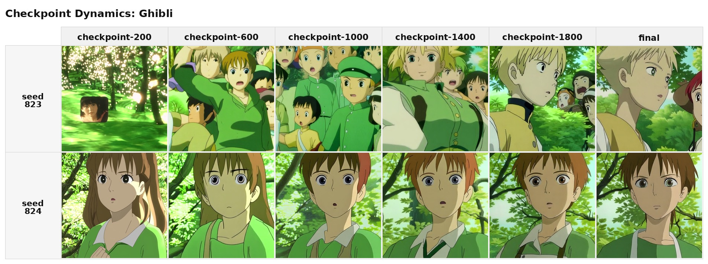

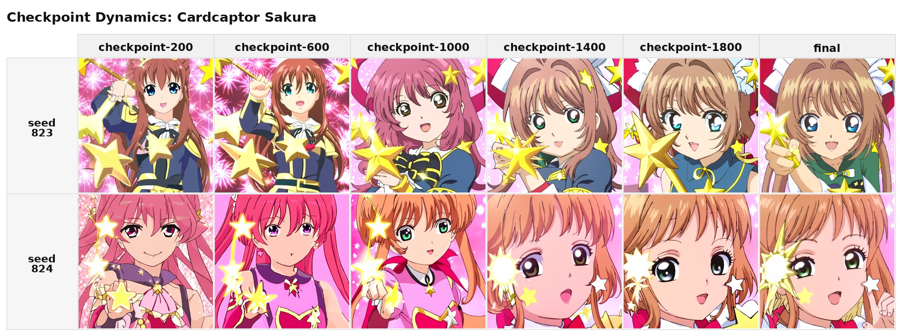

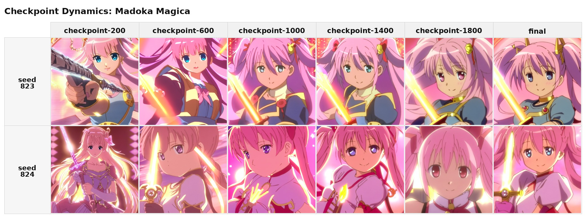

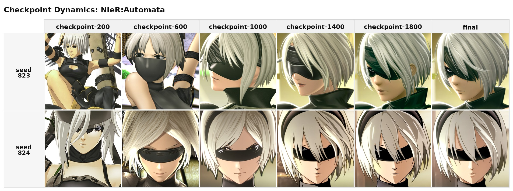

Checkpoint 动态展示了训练过程中 LoRA 表征逐步形成的过程。早期 checkpoint 已经能学习到部分主色调、人物轮廓或背景倾向，但身份稳定性和细节一致性不足，常见表现是发色或服装颜色接近目标，而脸部、配饰、姿态仍然比较像 base SDXL 的通用动漫先验。进入中期后，触发词开始更稳定地调用训练集特征，角色的服装结构、发型和画面色调变得更一致，风格型数据集也开始呈现更稳定的背景组织和线条质感。

后期 checkpoint 通常更接近训练集偏好，尤其对角色型数据集更有利，因为身份、服装和关键配饰会被反复强化。不过 final 并不总是线性优于中期结果：对于风格型数据集，中期有时保留更多场景变化和 prompt 遵循能力，而 final 可能更强烈地压缩到训练集常见构图；对于角色型数据集，final 更有利于身份一致性，但也可能引入姿态重复和局部细节僵硬。这个实验说明，实际使用 LoRA 时不应只依赖最终 checkpoint，也可以根据任务目标在中期和 final 之间选择。

## 4. 跨 Prompt 泛化


跨 prompt 泛化实验用于观察 LoRA 是否只记住训练图片，还是能够把训练到的身份或风格迁移到新语义环境中。结果显示，角色型 LoRA 在新服装和新背景下仍能保留发色、眼睛、服装色彩和标志性配饰等关键身份特征，说明触发词学习到的不只是单张图的像素模式，而是对角色视觉概念的压缩表示。风格型 LoRA 更容易迁移整体色调、手绘感、背景层次和线稿特征，即使 prompt 描述的场景不完全等同于训练集，也能把输出推向相应的画面风格。

失败主要集中在复杂道具、肢体结构和远离训练分布的场景中。此时模型会在 prompt 遵循和训练集偏置之间折中：如果 prompt 要求的动作或物体过于复杂，LoRA 可能只保留颜色和局部身份特征；如果 LoRA scale 较高，模型可能牺牲新场景的准确性，转而生成更接近训练集的构图。该实验说明，小样本 LoRA 具有一定泛化能力，但泛化更适合发生在（相近人物设定、相近画面类型、相近视觉语义）的范围内。

## 5. Multi-token Merge 控制

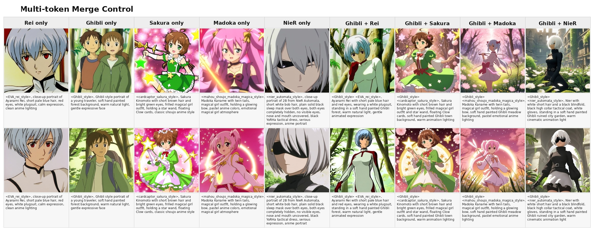

本实验将 5 个 LoRA 以 concat merge 合并，并保留各自触发词。单独触发某个 token 时，merged adapter 仍能表现对应风格或角色，说明 concat merge 后不同 token 的基本可用性没有完全丢失。同时触发 `<Ghibli_style>` 与其他 token 时，画面会尝试将 Ghibli 的手绘质感、柔和背景和暖色光照迁移到 Rei、Sakura、Madoka 与 Nier 等角色语义上。相比单 LoRA，multi-token merge 的目标不是追求某一个 token 的最强表现，而是验证多个 token 是否能在同一个 adapter 中共同存在，并在 prompt 中形成组合控制。

整体来看，多 token 控制可以组合身份和风格，但并非完全独立。人物 token 更容易主导脸部、发色和服装结构，因为这些特征与角色识别直接相关；风格 token 更多影响背景、色彩、笔触和画面质感，因为这些特征通常分布在全图层面。不同 token 同时出现时会发生竞争：如果两个 token 都包含强角色语义，模型可能优先保留更容易识别的人脸和服装；如果一个 token 偏风格、另一个偏角色，组合效果通常更自然。这个结果说明，多 LoRA merge 可以作为统一 adapter 的控制方案，但精确组合仍需要 prompt、scale 和 merge 权重共同调节。

## 6. Merge 权重比例

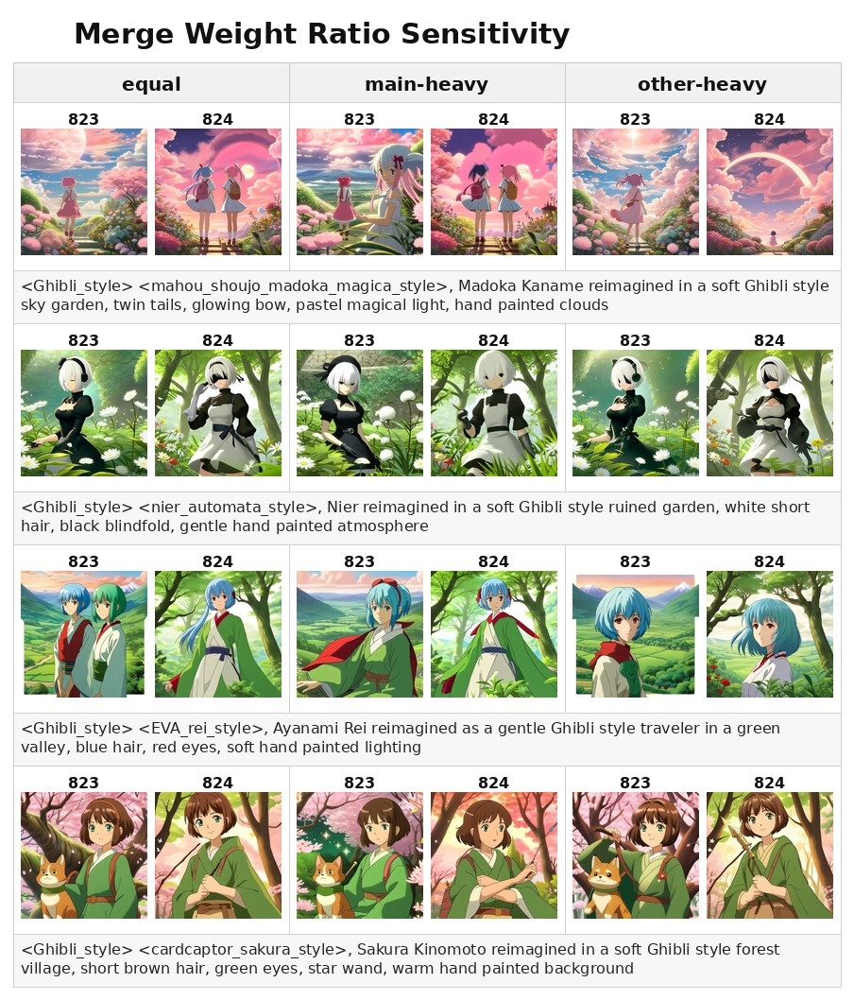

该实验固定 Ghibli 为主风格，分别与 Rei、Cardcaptor Sakura、Madoka Magica 和 Nier Automata LoRA 两两合并。三列分别使用 `equal`、`ghibli-heavy` 和 `other-heavy`：`equal` 让两个 LoRA 以相同权重参与，`ghibli-heavy` 提高 Ghibli 的相对占比，`other-heavy` 则提高另一个 LoRA 的相对占比。这样可以观察 merge 权重是否真的会改变生成结果的主导倾向，而不只是把多个 LoRA 简单堆叠在一起。

结果显示，提高 Ghibli 权重会增强手绘背景、柔和光照、自然色彩和整体动画质感；提高另一风格权重时，人物身份、服装语义、魔法少女装饰或暗色机械感会更明显。权重变化并不表现为严格线性的风格插值，而更像粗粒度偏置调节：某一方权重较高时，它会在更容易被模型识别的位置产生主导影响，例如脸部身份、服装轮廓或背景质感。这个实验说明，merge 权重适合用于调整合并模型的整体偏向，但如果需要精确控制身份和风格的分工，仍需要结合 token 设计、prompt 描述和可能的分层 LoRA 使用方式。

## 结论

在 5 个小样本动漫数据集上，SDXL LoRA 能有效学习可控的风格或角色 token。单 LoRA 在角色身份、服装语义、颜色倾向和背景风格上都有明显增益，说明小样本数据仍然可以为 SDXL 提供有效的局部适配能力。推理 scale 需要根据数据集类型调整：较低 scale 保留 prompt 自由度，较高 scale 强化身份或风格，默认中等 scale 通常更稳妥。checkpoint 动态显示，中后期训练会明显提高身份和风格一致性，但最终 checkpoint 不一定在所有场景下都最优。

多 token merge 可以在一个 adapter 中保留多个触发词，并支持一定程度的身份与风格组合，但组合控制存在竞争关系。merge 权重能够改变合并模型的倾向，不过更适合作为粗粒度调节，而不是精确线性混合。后续改进方向包括扩充样本覆盖、统一 caption 规范、将身份 LoRA 与纯风格 LoRA 分开训练，并进一步分析不同 merge 方法、不同权重分配和不同 token 命名方式对 token 独立性的影响。

## 代码仓库

本实验代码、脚本、报告文件和训练得到的 LoRA 权重已提交到 GitHub 仓库：[https://github.com/annealing-inversion/sd_sft](https://github.com/annealing-inversion/sd_sft)。由于 GitHub 仓库大小和单文件大小限制，SDXL base 1.0 的原始模型权重没有放入仓库；复现实验时需要按脚本说明从官方发布渠道另行获取 base 权重。

## 复现说明

报告图使用如下方式生成。实际运行时可根据需要指定输出目录、选择实验子集，或调整单个风格的推理 scale；报告正文只保留实验设置和观察结果，不依赖具体采样编号。

```bash
WIDTH=1024 HEIGHT=1024 STEPS=30 \
  EXPERIMENTS=base_vs_single,scale_sweep,checkpoint_dynamics,generalization \
  bash experiments/run_report_experiments.sh

WIDTH=1024 HEIGHT=1024 STEPS=30 \
  EXPERIMENTS=multitoken_merge,merge_weights \
  bash experiments/run_report_experiments.sh
```
